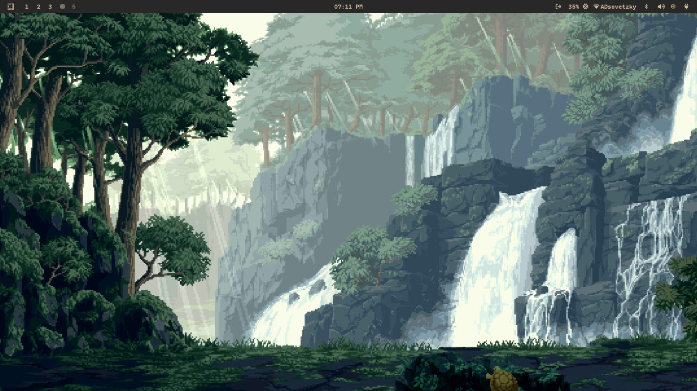

# Adso's Omarchy's waybar

## ✌️ Update
[Full releases here](https://github.com/adsovetzky/Adsovetzky-Omarchy-s-Waybar/releases)

## 🎨 Credit + describe

- **Waybar v1.3:** _Written by me alone!_ (only this one is up to omarchy 3.0, wait for another) 
- **Waybar v1.3a:** _it v1.3b but move the weather module into middle_
- **Waybar v1.3b:** _More customization for the network module_
- **Waybar v1.3c:** _Omarchy default waybar but with all v1.3 modules!_
- **Waybar v1.3c.2:** _Stil v1.3c but it float (what wrong with me)_
- **Waybar v1.4:** _Also by me, with great inspiration from_ [**forest green theme**](https://github.com/abhijeet-swami/omarchy-forest-green-theme/tree/main) 🌲
- **Waybar v1.5** _it v1.3 but in portrait orientation LOL (at this one, i remove mrpis, window and weather cuz it is too cumbersome to display it vertically, I would be shocked if someone actually used this as a waybar lfmao)_

---

## 🖼️ Preview

### Horizontal waybar:

#### Waybar v1.3


#### Waybar v1.3a


#### Waybar v1.3b


#### Waybar v1.3c


#### Waybar v1.3c.2


#### Waybar v1.4


### Vertical waybar:


---

## 🚀 Quick Install

Before install waybar, if you want weather feature, install this package (skip if you aready had it)
```
yay -S wttrbar
```

Choose the version of Waybar you want to use, copy the command, paste it into your terminal, and everything will work smoothly >w<!✨

<details>
<summary><strong>Waybar v1.3</strong></summary>

```
# clone the config from github
git clone https://github.com/adsovetzky/Adsovetzky-Omarchy-s-Waybar.git
cd Adsovetzky-Omarchy-s-Waybar

# Backup ur current config and style into "backup" folder
mkdir -p ~/.config/waybar/backup-waybar
[ -d ~/.config/waybar ] && mv ~/.config/waybar/* ~/.config/waybar/backup-waybar/ 2>/dev/null

# Replace with the new Waybar config!
cp -r ./waybar-1.3/config.jsonc ~/.config/waybar/
cp -r ./waybar-1.3/style.css ~/.config/waybar/

# Delete the clone
cd ..
rm -rf Adsovetzky-Omarchy-s-Waybar

# And now restart ur Waybar!!!
omarchy-restart-waybar

```
</details>

<details>
<summary><strong>Waybar v1.3a</strong></summary>

```
# clone the config from github
git clone https://github.com/adsovetzky/Adsovetzky-Omarchy-s-Waybar.git
cd Adsovetzky-Omarchy-s-Waybar

# Backup ur current config and style into "backup" folder
mkdir -p ~/.config/waybar/backup-waybar
[ -d ~/.config/waybar ] && mv ~/.config/waybar/* ~/.config/waybar/backup-waybar/ 2>/dev/null

# Replace with the new Waybar config!
cp -r ./waybar-1.3a/config.jsonc ~/.config/waybar/
cp -r ./waybar-1.3a/style.css ~/.config/waybar/

# Delete the clone
cd ..
rm -rf Adsovetzky-Omarchy-s-Waybar

# And now restart ur Waybar!!!
omarchy-restart-waybar

```
</details>

<details>
<summary><strong>Waybar v1.3b</strong></summary>

```
# clone the config from github
git clone https://github.com/adsovetzky/Adsovetzky-Omarchy-s-Waybar.git
cd Adsovetzky-Omarchy-s-Waybar

# Backup ur current config and style into "backup" folder
mkdir -p ~/.config/waybar/backup-waybar
[ -d ~/.config/waybar ] && mv ~/.config/waybar/* ~/.config/waybar/backup-waybar/ 2>/dev/null

# Replace with the new Waybar config!
cp -r ./waybar-1.3b/config.jsonc ~/.config/waybar/
cp -r ./waybar-1.3b/style.css ~/.config/waybar/

# Delete the clone
cd ..
rm -rf Adsovetzky-Omarchy-s-Waybar

# And now restart ur Waybar!!!
omarchy-restart-waybar

```
</details>

<details>
<summary><strong>Waybar v1.3c</strong></summary>

```
# clone the config from github
git clone https://github.com/adsovetzky/Adsovetzky-Omarchy-s-Waybar.git
cd Adsovetzky-Omarchy-s-Waybar

# Backup ur current config and style into "backup" folder
mkdir -p ~/.config/waybar/backup-waybar
[ -d ~/.config/waybar ] && mv ~/.config/waybar/* ~/.config/waybar/backup-waybar/ 2>/dev/null

# Replace with the new Waybar config!
cp -r ./waybar-1.3c/config.jsonc ~/.config/waybar/
cp -r ./waybar-1.3c/style.css ~/.config/waybar/

# Delete the clone
cd ..
rm -rf Adsovetzky-Omarchy-s-Waybar

# And now restart ur Waybar!!!
omarchy-restart-waybar

```
</details>

<details>
<summary><strong>Waybar v1.3c.2</strong></summary>

```
# clone the config from github
git clone https://github.com/adsovetzky/Adsovetzky-Omarchy-s-Waybar.git
cd Adsovetzky-Omarchy-s-Waybar

# Backup ur current config and style into "backup" folder
mkdir -p ~/.config/waybar/backup-waybar
[ -d ~/.config/waybar ] && mv ~/.config/waybar/* ~/.config/waybar/backup-waybar/ 2>/dev/null

# Replace with the new Waybar config!
cp -r ./waybar-1.3c.2/config.jsonc ~/.config/waybar/
cp -r ./waybar-1.3c.2/style.css ~/.config/waybar/

# Delete the clone
cd ..
rm -rf Adsovetzky-Omarchy-s-Waybar

# And now restart ur Waybar!!!
omarchy-restart-waybar

```
</details>

<details>
<summary><strong>Waybar v1.4</strong></summary>

```
# clone the config from github
git clone https://github.com/adsovetzky/Adsovetzky-Omarchy-s-Waybar.git
cd Adsovetzky-Omarchy-s-Waybar

# Backup ur current config and style into "backup" folder
mkdir -p ~/.config/waybar/backup-waybar
[ -d ~/.config/waybar ] && mv ~/.config/waybar/* ~/.config/waybar/backup-waybar/ 2>/dev/null

# Replace with the new Waybar config!
cp -r ./waybar-1.4/config.jsonc ~/.config/waybar/
cp -r ./waybar-1.4/style.css ~/.config/waybar/

# Delete the clone
cd ..
rm -rf Adsovetzky-Omarchy-s-Waybar

# And now restart ur Waybar!!!
omarchy-restart-waybar

```
</details>

<details>
<summary><strong>Waybar v1.5</strong></summary>

```
# clone the config from github
git clone https://github.com/adsovetzky/Adsovetzky-Omarchy-s-Waybar.git
cd Adsovetzky-Omarchy-s-Waybar

# Backup ur current config and style into "backup" folder
mkdir -p ~/.config/waybar/backup-waybar
[ -d ~/.config/waybar ] && mv ~/.config/waybar/* ~/.config/waybar/backup-waybar/ 2>/dev/null

# Replace with the new Waybar config!
cp -r ./waybar-1.5/config.jsonc ~/.config/waybar/
cp -r ./waybar-1.5/style.css ~/.config/waybar/

# Delete the clone
cd ..
rm -rf Adsovetzky-Omarchy-s-Waybar

# And now restart ur Waybar!!!
omarchy-restart-waybar

```
</details>
