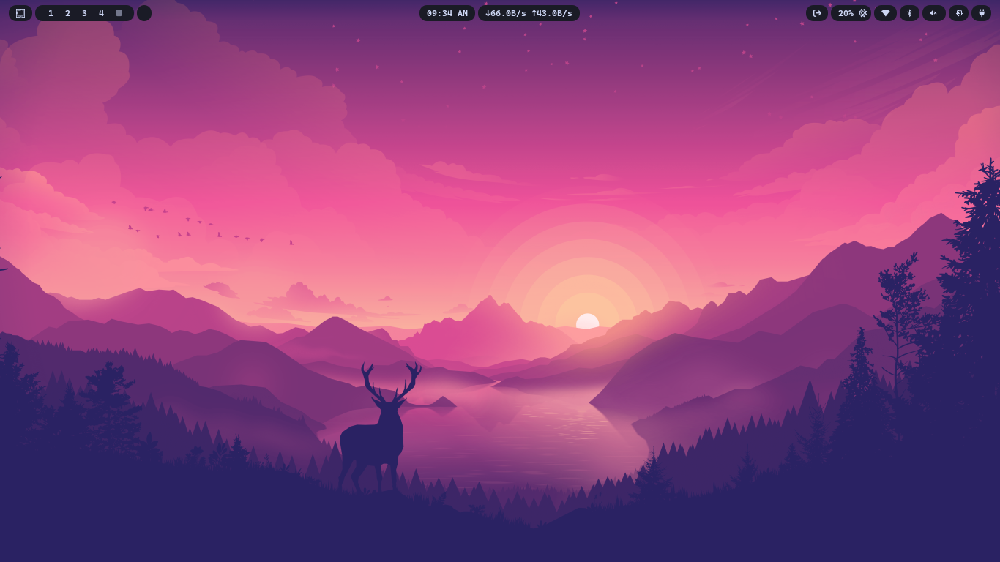

# Adso's Omarchy's waybar

## Credit

* Waybar v1.3: write by me alone!
* Waybar v1.3b: more customize for network module
* Waybar v1.4: also by me but great inspiration from [forest green theme](https://github.com/abhijeet-swami/omarchy-forest-green-theme/tree/main)!


## Preview

* Waybar v1.3)


* Waybar v1.3b)



* Waybar v1.4)


## Quick install

Choice what version of waybar u want to use, copy the command, paste it into ur terminal and everything will working smooth ^w^!

* Waybar v1.3
```
# clone the config from github
git clone https://github.com/adsovetzky/Adsovetzky-Omarchy-s-Waybar.git
cd Adsovetzky-Omarchy-s-Waybar

# Backup ur current config and style into "backup" folder
mkdir -p ~/.config/waybar/backup-waybar
[ -d ~/.config/waybar ] && mv ~/.config/waybar/* ~/.config/waybar/backup-waybar/ 2>/dev/null

# Replace with the new Waybar config!
cp -r ./waybar-1.3/config.jsonc ~/.config/waybar/
cp -r ./waybar-1.3/style.css ~/.config/waybar/

# Delete the clone
cd ..
rm -rf Adsovetzky-Omarchy-s-Waybar

# And now restart ur Waybar!!!
omarchy-restart-waybar

```

* Waybar v1.3b
```
# clone the config from github
git clone https://github.com/adsovetzky/Adsovetzky-Omarchy-s-Waybar.git
cd Adsovetzky-Omarchy-s-Waybar

# Backup ur current config and style into "backup" folder
mkdir -p ~/.config/waybar/backup-waybar
[ -d ~/.config/waybar ] && mv ~/.config/waybar/* ~/.config/waybar/backup-waybar/ 2>/dev/null

# Replace with the new Waybar config!
cp -r ./waybar-1.3b/config.jsonc ~/.config/waybar/
cp -r ./waybar-1.3b/style.css ~/.config/waybar/

# Delete the clone
cd ..
rm -rf Adsovetzky-Omarchy-s-Waybar

# And now restart ur Waybar!!!
omarchy-restart-waybar

```

* Waybar v1.4
```
# clone the config from github
git clone https://github.com/adsovetzky/Adsovetzky-Omarchy-s-Waybar.git
cd Adsovetzky-Omarchy-s-Waybar

# Backup ur current config and style into "backup" folder
mkdir -p ~/.config/waybar/backup-waybar
[ -d ~/.config/waybar ] && mv ~/.config/waybar/* ~/.config/waybar/backup-waybar/ 2>/dev/null

# Replace with the new Waybar config!
cp -r ./waybar-1.4/config.jsonc ~/.config/waybar/
cp -r ./waybar-1.4/style.css ~/.config/waybar/

# Delete the clone
cd ..
rm -rf Adsovetzky-Omarchy-s-Waybar

# And now restart ur Waybar!!!
omarchy-restart-waybar

```
